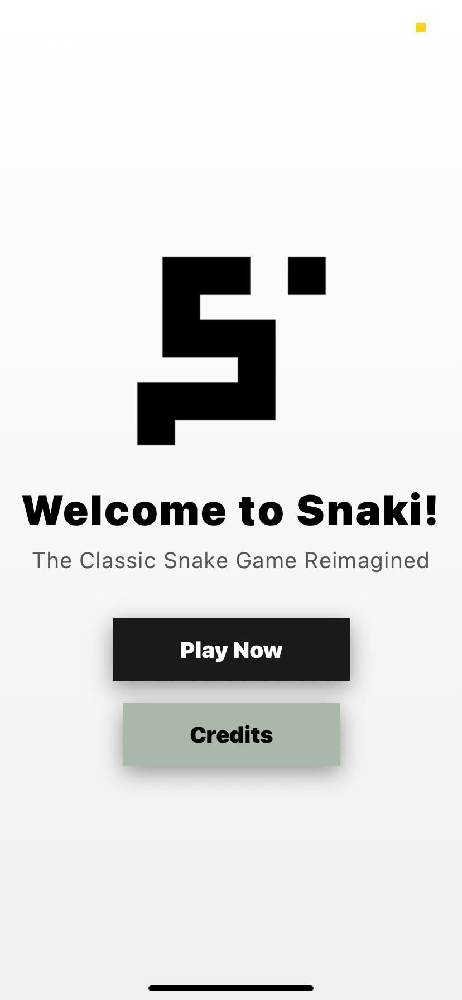
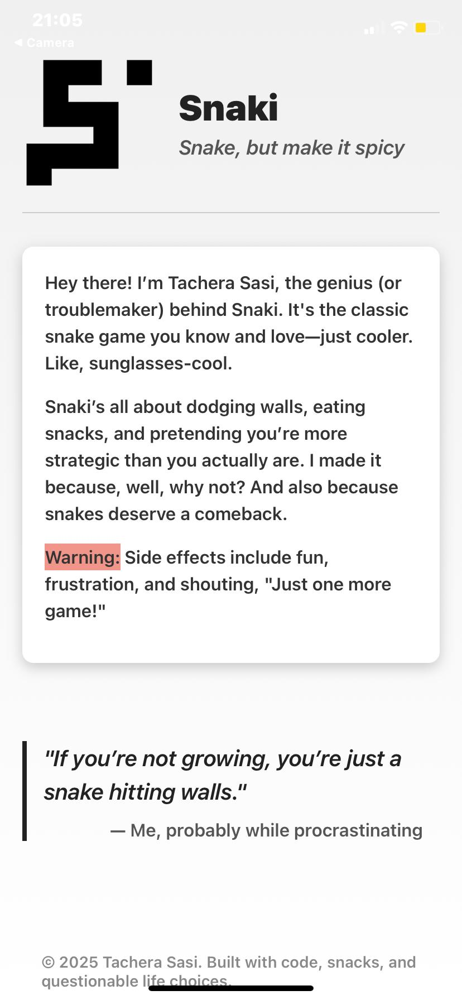
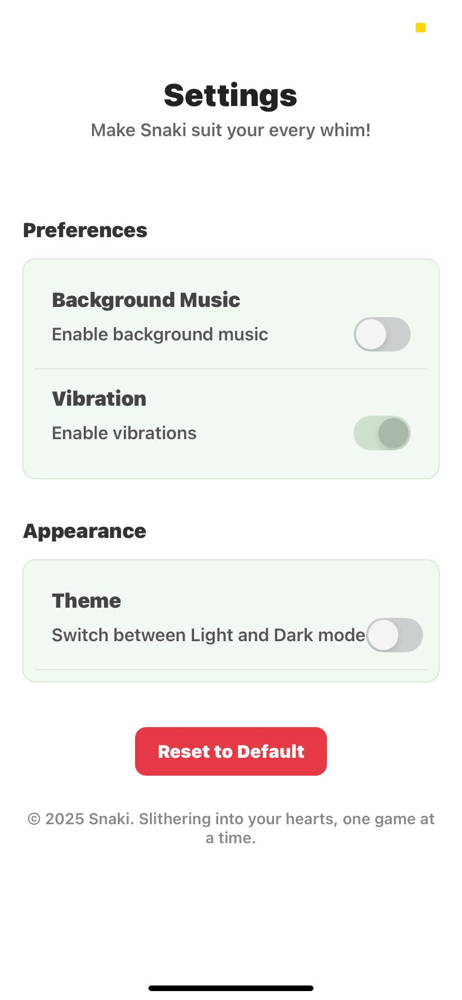

# Snaki - The Classic Snake Game Reimagined

## 🎮 Introduction
Welcome to **Snaki**, a reimagined version of the classic snake game, created by **Tachera Sasi**. Snaki blends the nostalgic charm of the original game with modern swipe gestures powered by React Native, offering a fresh and fun experience. 

Get ready to guide your snake, eat apples, and grow as long as possible without hitting walls or your own tail. It's addictive, competitive, and perfect for passing the time!

## 🚀 How to Play
1. **Swipe up**, **down**, **left**, or **right** to control the snake’s movement.
2. Eat the randomly appearing apples to grow your snake longer.
3. **The more apples you eat, the longer the snake gets**, increasing the challenge!
4. Avoid hitting the **walls** or your snake’s own body—do so, and it’s game over!
5. **Aim for the highest score** by eating as many apples as you can before crashing.

## 🌟 Features
- **Classic Snake gameplay** enhanced with swipe gestures for modern control.
- **Randomly generated apples** for unpredictable challenges.
- Smooth, responsive controls that make snake movement feel precise.
- **Difficulty increases** as the snake grows longer.
- **High score tracking** to challenge yourself and compete with friends.

## 📱 Controls
- **Swipe up** to move the snake upwards.
- **Swipe down** to move the snake downwards.
- **Swipe left** to move the snake to the left.
- **Swipe right** to move the snake to the right.

## ⚠️ Game Over
- The game ends when the snake collides with a **wall** or its own body.
- Your **final score** is displayed on the screen.
- Don’t worry—**swipe any direction** to restart the game and try to beat your best score!

## 🔧 Settings Page
Want to tweak the game? Head to the **Settings** to customize your gameplay experience. Adjust the controls, change the game speed, and even set your own theme! 

## 😄 Have Fun!
Snaki isn’t just about playing a game—it’s about **challenging yourself**, seeing how long you can grow your snake, and having a blast while doing it! So, jump in, eat those apples, and **try to beat your high score**. The game is just a swipe away!

---

Happy gaming! 🎮🍏
